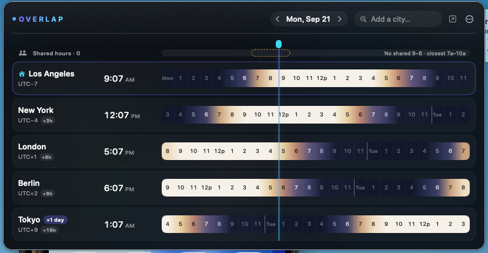

# Overlap

A native macOS menu bar app for comparing times across time zones and finding
good call/meeting windows — like worldtimebuddy.com, but much nicer.



## Features

- Lives in the menu bar — globe icon + your home city's current time.
- Dark-glass popover with one row per city: live local time, UTC offset,
  day badge, and a 24-hour strip colored by each city's *local* hour
  (bright = working, mid = fringe, dark = night). All strips share the
  home date's columns, so hours line up across rows.
- Now indicator: a gradient line across all rows at the exact current hour.
- Hover any column to see that hour in every city.
- Drag across hours to select a meeting window — a summary bar shows the
  equivalent time in every city, tinted by whether it's work/fringe/night
  for them, with one-click copy to the clipboard.
- "Shared hours" track highlights spans where *everyone* is in working
  hours (green), with an amber fallback tier and a best-effort hint when
  no shared window exists.
- Command bar: add cities by fuzzy search (name, identifier, aliases
  like "NYC"), or type natural language — `3pm Tokyo tomorrow`,
  `next tue 10am london`, `noon` — to jump the view to that instant.
- Global hotkey (default ⌥⇧O) toggles a standalone window centered at
  the mouse; record your own from the ⋯ menu.
- Calendar integration: optionally shade your busy events on the home
  row (EventKit), exclude them from shared windows, see "Conflicts"
  chips on selections, and create events from a selection — Plain,
  Slack, or Markdown invite formats.
- Widgets: a Clocks widget (small/medium) and an Overlap strip widget
  (medium/large) sharing your places via a shared file — right-click
  your desktop → Edit Widgets → Overlap.
- Add cities by fuzzy search. Reorder via context menu, set any city
  as home.
- Optional standalone window (pop-out button in the header).
- Launch at Login, 12/24-hour clock, light + dark mode.

## Build & run

Requires Xcode (26+) and [xcodegen](https://github.com/yonsm/XcodeGen).

```sh
make build   # xcodegen generate + xcodebuild Release build
make run     # opens the built Overlap.app
make test    # runs OverlapTests
```

Or open `Overlap.xcodeproj` directly in Xcode and press ⌘R.

## Keyboard shortcuts

- `⌘Q` — quit
- `⌘K` — focus the command bar
- `Esc` — clear the command text / clear the selection / dismiss
- `⌘←` / `⌘→` — move the selected date one day back/forward
- `⌘T` — back to today
- `⌥⇧O` — global hotkey: toggle the standalone window (configurable)

## Time math

All time conversion goes through `Calendar` with the target `TimeZone` —
each column is the instant "home midnight + h hours" converted into each
city's local components, so DST transitions are handled correctly.
